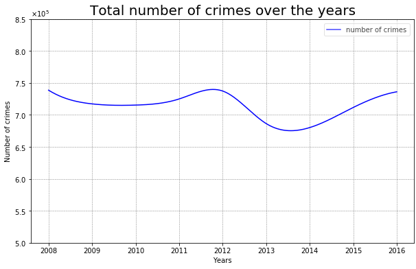

# London Crime - Big Data Analytics | a.y. 2018/19
#### Amendola M. Cornacchia G. Salinas M.

## Table of Contents
1. [Dataset Description](#dataset) 
2. [Data Cleaning](#cleaning) 
    1. [Missing Values](#mv)
    2. [Record Filtering](#rf)
3. [Exploratory Analysis](#ea)
    1. [Features Distributions](#fd)
    2. [Geolocalized Features Distribution](#geo)
    3. [Correlations](#cc)
        1. [Dataset Reshaping](#dr)
4. [Analytical Project Proposals](#app)

## 1. Dataset description ([to top](#top))
As first step we load the whole London Dataset and search for interesting numerical information.

The original dataset consists of 13.490.604 records, each record is described by 7 variables:

- The ``lsoa_code`` is a code that identifies the 4835 different LSOAs (Lower Layer Super Output Area), namely a geographic area inside London.

- The ``borough`` is a nominal variable that identifies one of the 33 borouhgs present in London, each of them contains a variable number of LSOAs.

- The ``major_category`` is a categorical attribute that specifies the category of the crime committed; there are 9 major categories: ``Theft and Handling``, ``Violence Against the Person``, ``Criminal Damage``, ``Robbery``, ``Burglary``, ``Other Notifiable Offences``, ``Drugs``, ``Sexual Offences``, ``Fraud or Forgery``.

- The ``minor_category`` is a categorical attribute that specifies precisely the crime commited; there are 32 minor categories.

- The ``year`` is a numerical attribute that indicates the year when the crime was committed, the crimes are collected for the year in the range [2008,2016].

- The ``month`` is a numerical attribute that defines in which month the crime was commited.

- The ``value`` is a numerical attribute that indicates how many crimes of a certain type in a certain period in a LSOA were commited.

## 2. Data Cleaning ([to top](#top))
In this stage, we investigate the presence of missing or useless values.

### 2.A Missing Values ([to top](#top))
Reviewing the data, there aren't null values or missing ones.

### 2.B Record Filtering ([to top](#top))
We choose to keep all columns in order to be able to analyze from different perspectives the crime distribution; but comes out that approximately the 70% of the records has a value equal to zero.

Considering a generic line of the dataset: 

for each ``lsoa_code``, ``minor_category``, ``month`` and ``year`` the ``value`` attribute specifies how many crimes of that kind were commited, even if there isn’t any crime that was commited.

Since a ``value`` = 0 gives no contribution for the computation of the standard statistical measures, the dataset was filtered deleting all the rows where the ``value`` was equal to 0.
This operation leads to an important memory space saving: we started with about 13M records and, after the filtering, we ended up with 3M *non-zero* records (the 23% of the real size).
This will also allowed a faster of computatios.

## 3. Exploratory Analysis ([to top](#top))
Now that our data is cleaned, we can explore them using standard visual and statistical tools. 

### 3.A Features Distributions ([to top](#top))
We start our analysis by having a look at the ditribution of the number of crimes over the years.

The line graph above shows that the number of crimes is equally distributed between the years with the peaks in 2008, 2012 and 2016; while in 2013 and 2014 there were fewer crimes.
In particular, the maximum number of crimes is in 2008 with a total of 738k crimes, while the lowest value is in 2014 with 680k crimes.

The trend can be defined as costant unless small fluctuations of $\pm 0.1\%$.
