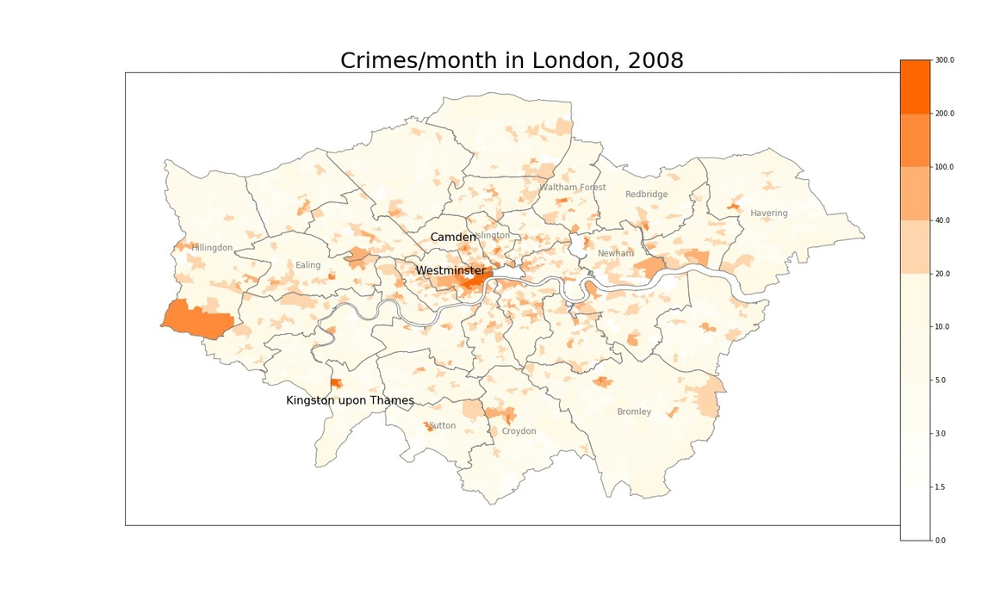

# London Crime - Big Data Analytics | a.y. 2018/19
#### Amendola M. Cornacchia G. Salinas M.

## Table of Contents
1. [Dataset Description](#dataset) 
2. [Data Cleaning](#cleaning) 
3. [Exploratory Analysis](#ea)
    1. [Features Distributions](#fd)
    2. [Geolocalized Features Distribution](#geo)
    3. [Correlations](#cc)
4. [Analytical Project Proposals](#app)

The goal of our analytic proposal is to output a parametric model capable of predicting the number of crimes in an LSOA or borough.

For detailed information about the project you can check the code in the jupyter notebook or read the [pdf report](Final_report[LONDON_CRIME].pdf).